# Text-to-Image Rectified Flow as Plug-and-Play Priors
<div align="left">
<a href='https://arxiv.org/abs/2406.03293'></a> 
</div>

<p style='text-align: justify;'> 
<em>by Xiaofeng Yang, Cheng Chen, Xulei Yang, Fayao Liu, Guosheng Lin.</em>
</p><p style='text-align: justify;'> 
Large-scale diffusion models have achieved remarkable performance in generative tasks. Beyond their initial training applications, these models have proven their ability to function as versatile plug-and-play priors. For instance, 2D diffusion models can serve as loss functions to optimize 3D implicit models. Rectified flow, a novel class of generative models, enforces a linear progression from the source to the target distribution and has demonstrated superior performance across various domains. Compared to diffusion-based methods, rectified flow approaches surpass in terms of generation quality and efficiency, requiring fewer inference steps. In this work, we present theoretical and experimental evidence demonstrating that rectified flow based methods offer similar functionalities to diffusion models — they can also serve as effective priors. Besides the generative capabilities of diffusion priors, motivated by the unique time-symmetry properties of rectified flow models, a variant of our method can additionally perform image inversion. Experimentally, our rectified flow-based priors outperform their diffusion counterparts — the SDS and VSD losses — in text-to-3D generation. Our method also displays competitive performance in image inversion and editing.</p>

## Updates
- 2024/06/05: Code release.
- 2024/06/21: Add support for Stable Diffusion 3 (June, Medium version).
- 2024/10/01: We extended the paper with the Stochastic Interpolants framework. In addition to the rectified flow models, the new theory can also be applied to diffusion models expressed in PF-ODE. An updated version with be uploaded to arxiv shortly after ECCV. We also optimized the SD3 code to help understanding. 


## ToDo

- [x] Code release. The base text-to-image model is based on **[InstaFlow](https://github.com/gnobitab/InstaFlow)**.
- [x] Add support for Stable Diffusion 3 after the model is released.
- [ ] Stability AI will release "a much improved version" of SD3 soon (refer to [here](https://twitter.com/StabilityAI/status/1809274936847933715)). We'll add support for the new version ASAP.


## Installation


Our codes are based on the implementations of **[ThreeStudio](https://github.com/threestudio-project/threestudio)**.
Please follow the instructions in ThreeStudio to install the dependencies.

**_To use SD3_**:
**_please follow the [instructions here](https://github.com/huggingface/diffusers/releases/tag/v0.29.0) to login to huggingface and update diffusers. When you run our codes, the models will be automatically downloaded._**


## Quickstart

<details>
  <summary>Using Stable Diffusion 3 as the base rectified-flow model.</summary>
    
### 2D Playground (SD3)
```
# run RFDS in 2D space for image generation
python 2dplayground_RFDS_sd3.py

# run RFDS-Rev in 2D space for image generation
python 2dplayground_RFDS_Rev_sd3.py

# run iRFDS in 2D space for image editing (requires 20g GPU memory)
python 2dplayground_iRFDS_sd3.py
```

### Text-to-3D with RFDS (SD3) (requires 46g GPU memory)
```
python launch.py --config configs/rfds_sd3.yaml --train --gpu 0 system.prompt_processor.prompt="A DSLR photo of a hamburger" 
```

### Text-to-3D with RFDS-Rev (SD3) (requires >46g GPU memory)
```
python launch.py --config configs/rfds-rev_sd3.yaml --train --gpu 0 system.prompt_processor.prompt="A DSLR photo of a hamburger" 
```

### Text-to-3D with RFDS-Rev, reduced memory usage (SD3) (able to run on 46g GPUs)
```
python launch.py --config configs/rfds-rev_sd3_low_memory.yaml --train --gpu 0 system.prompt_processor.prompt="A DSLR photo of a hamburger" 
```


## Results

### Optimization in 2D space (SD3)
Caption: A DSLR image of a hamburger
<table style="border: none;">
  <tr>
    <td style="text-align: center;">
      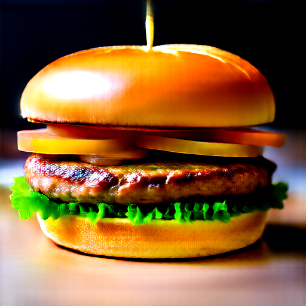
      <br><em>RFDS</em>
    </td>
    <td style="text-align: center;">
      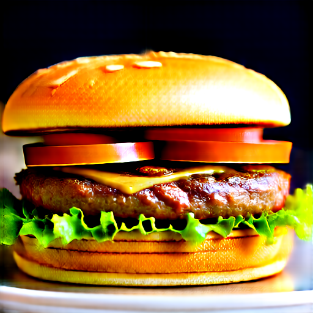
      <br><em>RFDS-Rev</em>
    </td>
  </tr>
</table>

### Text-to-3D with RFDS (NeRF backbone, SD3)

<table style="border: none;">
  <tr>
    <td style="text-align: center;">
      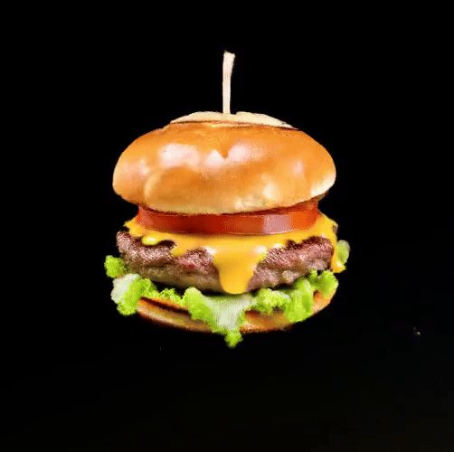
      <br><em>A DSLR image of a hamburger</em>
    </td>
    <td style="text-align: center;">
      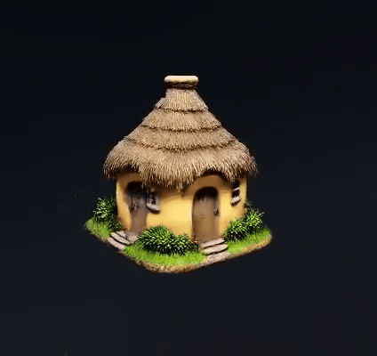
      <br><em>A 3d model of an adorable cottage with a thatched roof</em>
    </td>
  </tr>
</table>

### Text-to-3D with RFDS-Rev (NeRF backbone, SD3)

<table style="border: none;">
  <tr>
    <td style="text-align: center;">
      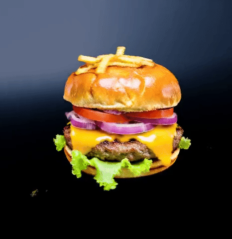
      <br><em>A DSLR image of a hamburger</em>
    </td>
    <td style="text-align: center;">
      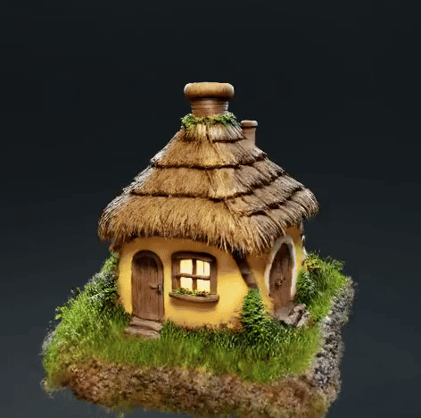
      <br><em>A 3d model of an adorable cottage with a thatched roof</em>
    </td>
  </tr>
</table>


### Text guided editing with iRFDS (SD3)
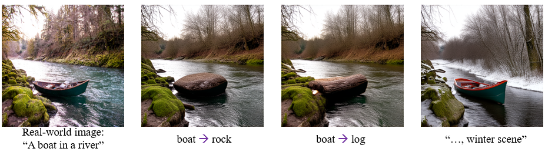

### Remarks for SD3

- In SD3, the RFDS baseline already delivers great results. If your GPU memory is limited, it's recommended to use the RFDS baseline version.
- SD3 is not trained with reflow (check out the InstaFlow paper for more on that). So, we found it a bit tougher to do image inversion using iRFDS and SD3.
Additionally, the transformer backbone makes it difficult to replace objects with text control without using prompt-to-prompt.
</details>


<details>
  <summary>Using InstaFlow as the base rectified-flow model (use less GPU memory).</summary>
    
### 2D Playground (InstaFlow)
```
# run RFDS in 2D space for image generation
python 2dplayground_RFDS.py

# run RFDS-Rev in 2D space for image generation
python 2dplayground_RFDS_Rev.py

# run iRFDS in 2D space for image editing
python 2dplayground_iRFDS.py
```

### Text-to-3D with RFDS (InstaFlow)
```
python launch.py --config configs/rfds.yaml --train --gpu 0 system.prompt_processor.prompt="A DSLR photo of a hamburger" 
```

### Text-to-3D with RFDS-Rev (InstaFlow)
```
python launch.py --config configs/rfds-rev.yaml --train --gpu 0 system.prompt_processor.prompt="A DSLR photo of a hamburger" 
```

## Results

### Optimization in 2D space (InstaFlow)
Caption: an astronaut is riding a horse
<table style="border: none;">
  <tr>
    <td style="text-align: center;">
      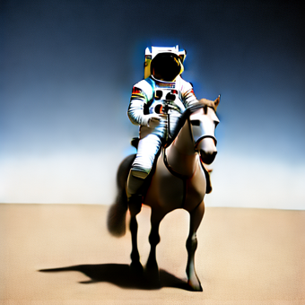
      <br><em>RFDS</em>
    </td>
    <td style="text-align: center;">
      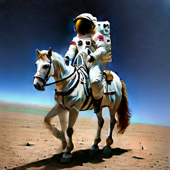
      <br><em>RFDS-Rev</em>
    </td>
  </tr>
</table>

### Text-to-3D with RFDS-Rev (NeRF backbone, InstaFlow)

<table style="border: none;">
  <tr>
    <td style="text-align: center;">
      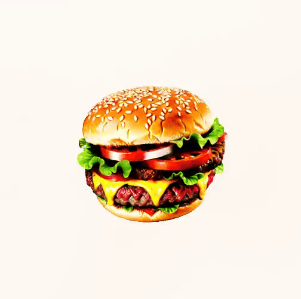
      <br><em>A DSLR image of a hamburger</em>
    </td>
    <td style="text-align: center;">
      
      <br><em>An intricate ceramic vase with peonies painted on it</em>
    </td>
  </tr>
</table>

### Text guided editing with iRFDS (InstaFlow)
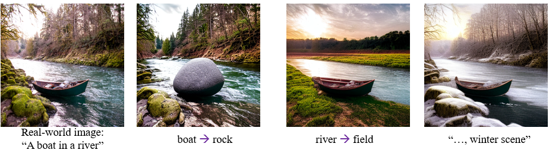
</details>


## Credits

RFDS is built on the following open-source projects:
- **[ThreeStudio](https://github.com/threestudio-project/threestudio)** Main Framework
- **[InstaFlow](https://github.com/gnobitab/InstaFlow)** Large-scale text-to-image Rectified Flow model


## Citation
```
@article{yang2024rfds,
  title={Text-to-Image Rectified Flow as Plug-and-Play Priors},
  author={Xiaofeng Yang and Cheng Chen and Xulei Yang and Fayao Liu and Guosheng Lin},
  journal={arXiv-2406.03293},
  year={2024}
}
```
 
